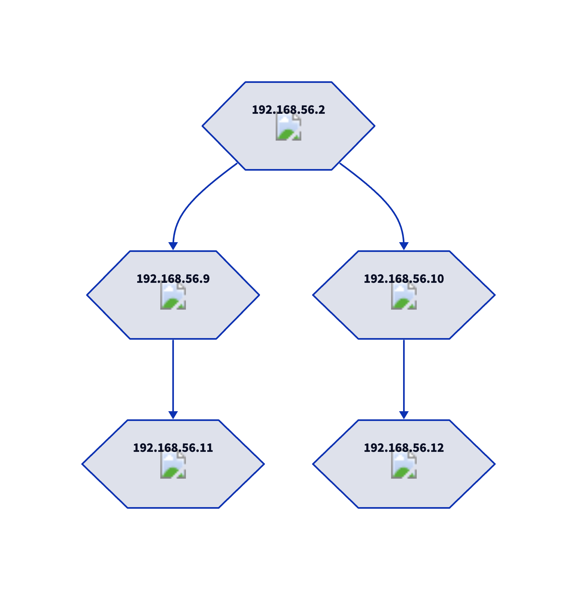

# Vagrant-haproxy-keepalived

Demo of HAProxy high availability using Vagrant.

This project sets up the following VMs on a private network in VirtualBox:

- haproxy1 (192.168.56.9)
- haproxy2 (192.168.56.10)
- web1 (192.168.56.11)
- web2 (192.168.56.12)

The HAProxy servers are themselves made redundant via keepalived, with
virtual IP 192.168.56.2.

# Prerequisites

1.  Install [Vagrant](http://www.vagrantup.com/downloads.html)
2.  Install [Virtualbox](https://www.virtualbox.org/wiki/Downloads)
3.  Either clone this repo, or download the zip file and extract it to an empty directory.

# Getting started

- From the root directory, run `vagrant up`
- View the various pages:
  - source web sites: e.g., http://192.168.56.11
  - web site, load-balanced via HA Proxy: e.g., http://192.168.56.9
  - web site, through the virtual IP: http://192.168.56.2
  - HA proxy status: e.g., http://192.168.56.2/haproxy?stats

## Determining the active HAProxy

keepalived is an implementation of the VRRP (Virtual Router Redundancy
Protocol) protocol to make IPs highly available - a so called VIP
(Virtual IP).

You can check which HAProxy server is currently handling requests to the virtual IP 192.168.1.2 by checking the server's ip addresses:

    $ vagrant ssh haproxy1 -c "echo haproxy1; ip addr | grep 192.168.56.2/32"
    haproxy1
        inet 192.168.56.2/32 scope global eth1
        Connection to 127.0.0.56 closed.
        $ vagrant ssh haproxy2 -c "echo haproxy2; ip addr | grep 192.168.56.2/32"
    haproxy2
    Connection to 127.0.0.1 closed.

## Scenarios to investigate

Try turning various servers on and off, and visit any of the URLs to
see what the results are. As HAProxy services are turned on and off,
also check the active HAProxy.

Examples:

- `vagrant ssh web1 -c "sudo service apache2 stop"`
- `vagrant ssh web1 -c "sudo service apache2 start"`
- `vagrant ssh haproxy1 -c "sudo service haproxy stop"`
- `vagrant ssh haproxy1 -c "sudo service haproxy start"`

# Shutting down

- `vagrant halt` turns off vms
- `vagrant destroy` destroys all traces of the VMs, but leaves the
  cached images
- `vagrant box remove ...` removes the downloaded image file.

# Reference material

- [Vagrant](http://vagrantup.com)
- [VirtualBox](http://www.virtualbox.org)
- [HAProxy](http://haproxy.1wt.eu/)
- [Keepalived](http://www.keepalived.org/)
